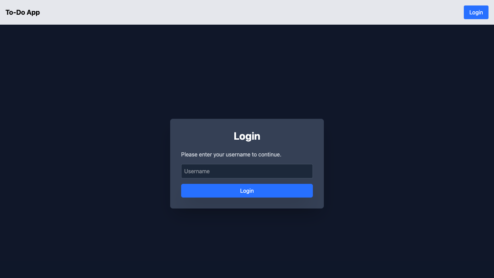
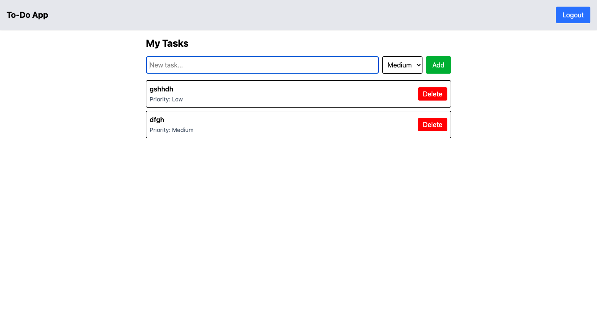

# 📝 To-Do App with Authentication (React + Redux + Tailwind CSS)

A simple and clean to-do list app built with **React**, **Redux Toolkit**, **React Router**, and **Tailwind CSS**. This project also includes a basic mock **authentication** system to demonstrate protected routes and login/logout functionality.

---

## ✨ Features

-   ✅ User authentication (mocked using Redux)
-   🔒 Protected routes – only logged-in users can access the to-do list
-   ➕ Add tasks with priority selection (High, Medium, Low)
-   ❌ Delete tasks
-   💾 Persistent task storage using `localStorage`
-   🎨 Beautiful UI with Tailwind CSS

---

## 🚀 Getting Started

### 1. Clone the Repository

```bash
git clone https://github.com/your-username/todo-auth-app.git
cd todo-auth-app
```

### 2. Install Dependencies

```bash
npm install
```

### 3. Start the Development Server

```bash
npm dev
```

The app will run on: http://localhost:3000

## 🔧 Project Structure

```pgsql
src/
├── features/
│   ├── auth/
│   │   └── authSlice.js
│   └── tasks/
│       └── taskSlice.js
├── components/
│   ├── Header.jsx
│   ├── TaskInput.jsx
│   └── TaskList.jsx
├── pages/
│   ├── Home.jsx
│   └── Login.jsx
├── App.jsx
├── store.js
└── index.js
```

## 🔐 Authentication Flow

-   User enters a username on the Login page
-   On submit, Redux stores the user state and sets isAuthenticated: true
-   The user is redirected to the home page (to-do list)
-   A Logout button is shown in the header when logged in

## 🛠 Technologies Used

-   React
-   Redux Toolkit
-   React Router
-   Tailwind CSS

## 📦 Available Scripts

`npm dev` – Start dev server

`npm run build` – Create a production build

## 💡 Author

Made with ❤️ by **Manish Kumar**

## 🌐 Project Preview

### Login page



### User Dashboard


